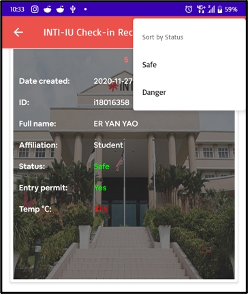

## 🚨 Cloning or Forking this repo (must read!)

> "Plagiarism brings on bad karma and may lead to reincarnation as a bad piece of art or, worse, a bad politician" *Jacques Vesery*

If you found this project useful for you, please acknowledge the effort of the authors by **giving this repo a star**. The attribution of yours would help the open source community go a long way.

#### 1. Disclaimer: 

This project is solely created for academic purposes and do not represent those of my employer

#### 2. Important:

The **QR code generated** has to be scanned with this **Medicine QR code scanner** for ideal outcome.

### System workflow

*(Solely focusing on **Medicine QR Code Scanner App**)*

### Mobile screenshots

### QR code scanner

### QR code scanner results

### Approve entry

### QR code scanner records

## Inspiration

1. https://uit.stanford.edu/news/access-stanford-health-check-tool-through-mobile-app
2. https://covid19.nhs.uk

## Acknowledgements

This is one of the projects built by Chung Yee Han, Er Yan Yao, and Low Yong Ting in November 2020 within 2 weeks for course subject **Mobile Application Development, PRG4201** by **Dr. Deshinta Arrova Dewi**.